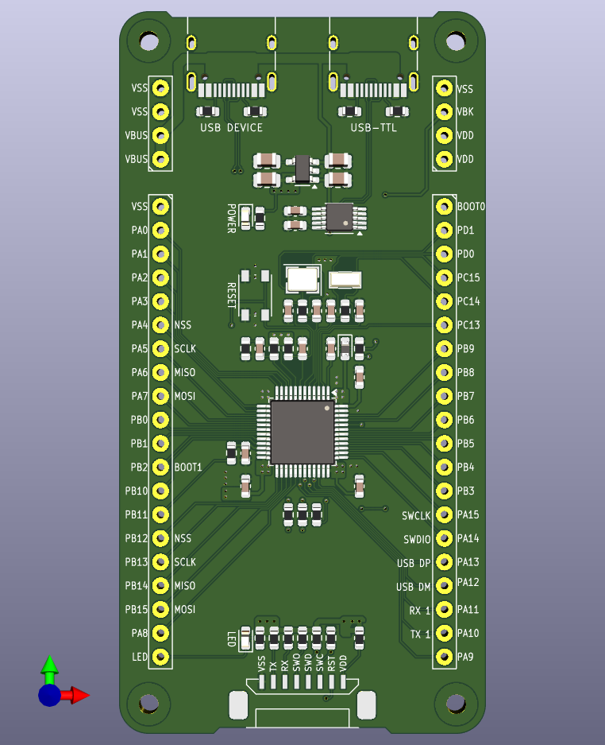
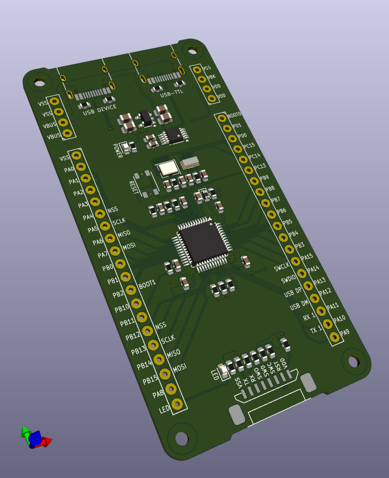

# STM32F103C8单片机核心板
这是一款设计用于STM32F103C8T6单片机及引脚布局兼容单片机的核心板设计。

原理图和PCB设计使用KiCAD完成，依赖以下符号库和封装库。
 - [kicad_libs_append](https://github.com/Polarix/kicad_libs_append)

## 设计目标
电路设计尝试兼容以下芯片及其引脚兼容型号：

|型号|封装|特征及其改动|
|-|-|-|
|STM32F103C8T6|LQFP-48|以此为基础型号。|
|STM32F030C8T6|LQFP-48|取消一组电源，35、36两个引脚增加PF6、PF7两个GPIO，可复用为USART3的TX、RX两个引脚以及TIM16和TIM17的1通道。|
|STM32F401CCU6|QFN-48|34脚改为VCAP，用作内部电压调节器滤波，并取消了PB11引脚，USART3不可用并被替换为了USART6。|

## 预览图

